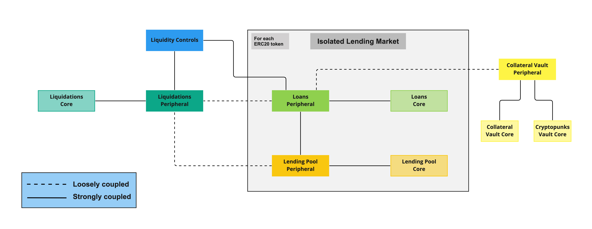
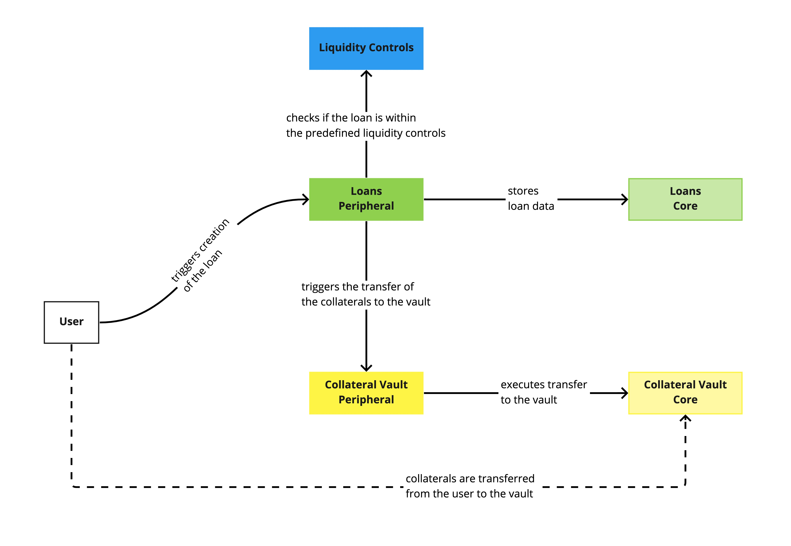

# Introduction

The protocol part of the Zharta offering comprises the smart contracts that govern the logic for the lending pools (LPs), the loans and the liquidations. There are two components of the Zharta core offering (peer-to-pool NFT-backed loans) that are not on-chain:
* the NFT appraisal engine (NAE)
* the risk management engine (RME)

These off-chain components provide input for the on-chain protocol as admin functionalities.

# Overview
| **Version** | **Language** | **Reference implementation** |
|---|---|---|
| V1 | Vyper 0.3.6 | https://gitlab.com/z106/protocol-v1 |

Zharta V1 is a binary smart contract system comprised of many smart contracts. Each domain is comprised of two smart contracts, the Core and the Periphery.

The Core contracts define the data structures and the necessary storage for the domain. They are less flexible contracts and can be viewed as the database of the domain. Within each domain, the Core contract methods can only be called by its correspondent Periphery contract.

The Periphery contracts define the protocol logic and are the gateway to interact with the domain. Each Periphery contract can interact with several other Periphery contracts. They provide fundamental safety guarantees for parties interacting with Zharta and provide permissionless publicly-callable methods for each specific domain.

The Periphery contracts are more easily changed since they hold no storage variables, they only hold protocol logic. Since the domain storage exists in the domain-specific Core contract, it is easier to deploy a new domain-specific Periphery contract and point it to the Core contract and vice-versa.

Zharta V1 is divided into the following domains:
* Loans
* Lending Pool (LP)
* Collateral Vault (CV)
* Liquidations
* Liquidity Controls (LC)

# General considerations

Zharta will launch the V1 of the protocol with the following restrictions:
* maturity-based loans with at most 30 days
* one single lending pool of WETH
* no liquidations before a loan's maturity date

# Architecture

As previously stated, each domain is composed of a Core and Periphery pair of contracts. This composition is represented in the diagram as a strong coupling between those contracts.

In addition, V1 is designed such that for each ERC20 token that the lenders can deposit and borrowers can borrow from the protocol, there is a deployed isolated lending market (ILM) comprised of the Core and Periphery contract pairs for the Loans and LP domains. This means that for each LP contract pair (Core and Periphery), there is a specific Loans contract pair (Core and Periphery), and only the specific Loans Periphery contract can interact with the LP Periphery contract.

As for the CV, Liquidations and Liquidity Controls domains, they are not specific to each ERC20 token and serve all the deployed ILMs.

## Liquidity Controls

The liquidity controls contract exists as the first and simple layer of automated risk management. The table below outlines the current implemented controls.

| **Name** | **Target** | **Current Value** | **Description** |
|---|---|---|---|
| Loan-to-deposit ratio | Lenders | 70% | This represents the maximum utilisation of pools and when set to less than 100%, it allows for a buffer for withdrawals by lenders. |
|  | Borrowers | 70% | This represents the maximum utilisation of pools and when set to less than 100%, it allows for less funds available for loans taken by borrowers. |
| Limit per pool | Lenders | 15% | This represents the maximum share that a single lender can take from a lending pool. |
|  | Borrowers | 15% | This represents the maximum share that a single borrower can represent from the total amount of borrowed funds. |
| Diversification of collections | Lenders | _NA_ | _NA_ |
|  | Borrowers | 50% | The represents the maximum share that a single collection can represent from the total amount of borrowed funds. |
| Funds withdrawals | Lenders | 7 days lock period | This represents the lock period applicable for deposits in lending pools, i.e. for each new deposit, it can’t be withdrawn before the lock period finishes. If the lender already has an ongoing lock period, a new deposit won’t extend the lock period. |
|  | Borrowers | _NA_ | _NA_ |

## Loan creation flow - a mix between on-chain and off-chain processes

The loan creation flow has two steps:
1. The loan is created on-chain by the borrower
    - the borrower should call Zharta's APIs beforehand to get the conditions for the loan given the NFTs chosen to be used as collateral
    - Zharta's portal simplifies this for now
2. After the loan is created, Zharta's off-chain indexer reacts to it and either validates or invalidated the loan, depending on the conditions that were set

# Protocol Diagrams

In the diagrams below, the coloured boxes (i.e. boxes that don’t have a white background) represent smart contracts.

## Loan creation

## Loan validation/invalidation

## Loan payment

## Loan default

The loans can only be defaulted if and only if the borrower didn't repay the loan by the end of the maturity date.

Although this may change in the future, as of the first iteration of the protocol, the loan defaults can only be triggered by Zharta.

### Collateral Liquidation

#### During liquidation periods

The liquidation periods are periods where only certain actors can take part in the liquidation of the collateral:
* Grace period: only for the borrower
* Lenders period: only for the lenders

#### When liquidation periods end

## LP deposit

## LP withdrawals

# Deployment Diagram

